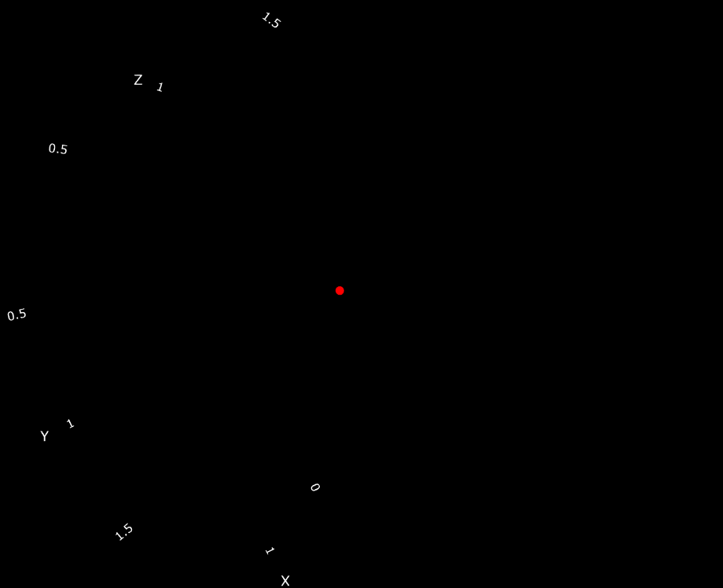

## STIFFCHAOS
### ROSENBROCK 3-STAGE SOLVER FOR STIFF SYSTEMS AND CHAOTIC DYNAMICS

StiffChaos-C is an experimental implementation of a 3-stage Rosenbrock (ROS3) solver for stiff ordinary differential equations and chaotic dynamical systems. The project focuses on numerical stability, adaptive step-size control and deterministic execution under constrained memory conditions.



## Why this matters

Many physical and chemical systems evolve across widely different time scales, making explicit integration methods unstable or inefficient.

Implicit Rosenbrock methods provide a practical compromise between stability and computational cost, especially in environments where deterministic execution and bounded memory usage are important.

### Design Goals

* Implicit error control (using a two-stage embedded method)
* Dynamic step size calculated based on the error-to-tolerance ratio
* No dynamic memory allocation (`malloc/free`)
* Static memory footprint
* Designed with embedded and bare-metal constraints in mind

---

### PROJECT STRUCTURE

```text
.
├── CMakeLists.txt      # System build configuration
├── include/            # Core headers (ros3.h, system.h)
├── solver/             # Numerical core implementation
├── models/             # Physical system definitions (Robertson, Lorenz)
├── tests/              # Execution entry points and validation
├── vis/                # Plotly-based data visualization
└── gallery/            # Validated simulation outputs
```

---

### BUILD AND EXECUTION PROTOCOL

Execution requires:
- CMake 3.10+
- Standard C99 compiler

```bash
mkdir -p build && cd build
cmake ..
make
./test_robertson
```

---

### Numerical Stability: The Robertson System

The system models kinetic reactions in which the reaction rate changes drastically, whilst obeying a linear conservation law:

The Robertson system is frequently used to assess the stability of time integrators, given its extreme stiffness and the ability to measure the actual numerical drift using only the values of the three variables.

  * $$\frac{dX}{dt} = -0.04X + 10^4YZ$$
  * $$\frac{dY}{dt} = 0.04X - 10^4YZ - 3 \cdot 10^7Y^2$$
  * $$\frac{dZ}{dt} = 3 \cdot 10^7Y^2$$
  * Initial Conditions $$[X(0),Y(0),Z(0)]^T = [1.0,\ 0.0,\ 0.0]^T$$
  * Conservation Invariant:  $$X + Y + Z = 1.0$$.

The Robertson problem is used as a stability benchmark due to its extreme stiffness and conserved quantity.

After $$10^8$$ accepted steps, the observed drift in the conservation invariant remains on the order of $$10^{-12}$$.

---

### Execution Output

```text
(TIME 100000.0006)
X: 0.016926090730 Y: 0.000000068856 Z: 0.983073840415 SUM: 1.000000000000142109
H STEP: 1.000000e-03 ERR/TOL: 2.282618476728e-04
----------------------------------------------------------------------
FINAL RESULTS
Elapsed time: 18.3649 (secs)
Steps accepted: 100697447
Percentage steps accepted: 100.00
Steps rejected: 9
Percentage steps rejected: 0.00
Total simulated time (SUM h accepted): 100000.0006
NUMBER OF STEPS: 100697456
Max H_STEP used: 1.0000e-03
Min H_STEP used: 1.0000e-09
---------------------END OF SIMULATION--------------------------------------
```
